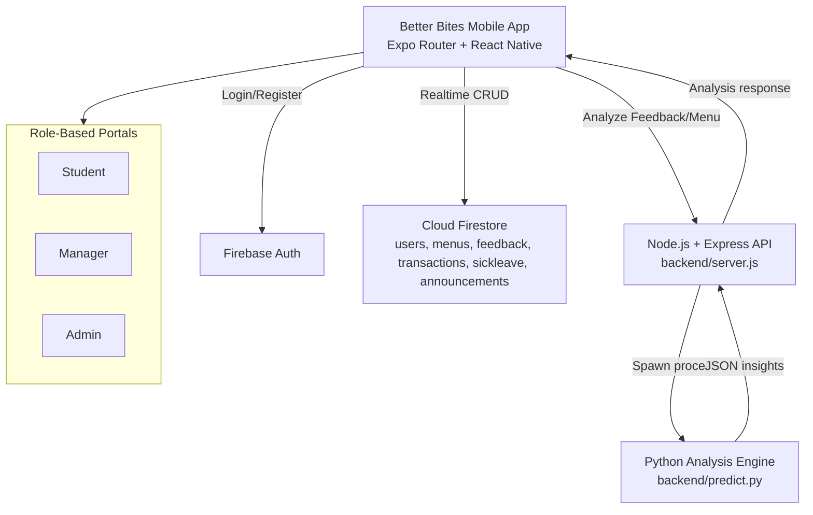

<h1 align="center">Better Bites</h1>
<p align="center">
	<b>Smart Hostel Mess Management System for Students, Managers, and Admins</b>
</p>
<p align="center">
	
	
	
	
	
	
	
</p>

---

## What is Better Bites?

Better Bites is a full-stack, role-based mess management platform designed for hostel ecosystems. It modernizes daily food operations with real-time data, smooth mobile UX, and AI-assisted insights.

The platform provides:

- Student workflows for menu viewing, wallet tracking, feedback, and sick leave
- Manager controls for menu operations, feedback review, and announcements
- Admin oversight for users, managers, analytics, predictions, and audit modules
- AI-assisted backend analysis for feedback sentiment and menu optimization

---

## Architecture



---

## Core Features

| Module | Highlights |
|---|---|
| Student Experience | Registration with health profile, dashboard quick actions, daily menu by meal session, wallet ledger, feedback submission, sick leave request flow |
| Manager Console | Menu management, leave approval workflow, feedback review with filtering, announcement management, operational dashboard |
| Admin Control Tower | User management, manager management, announcement center, activity logs, nutrition insights, food-demand prediction, system analytics |
| AI Insight Layer | Feedback analysis endpoint and menu optimization endpoint powered through Node.js to Python execution pipeline |
| UX & Motion | Moti-driven transitions, animated cards/counters, role-focused themed dashboards, responsive Expo UI components |
| Security & Access | Firebase Authentication, role-aware routing and role-specific pages |

---

## Tech Stack

| Layer | Technology |
|---|---|
| Mobile App | Expo SDK 54, React Native 0.81, Expo Router |
| Language | TypeScript + JavaScript |
| UI & Animation | React Native Paper, Moti, React Native Reanimated, Lottie |
| Navigation | Expo Router, React Navigation |
| Backend API | Node.js, Express, body-parser, CORS |
| AI Worker | Python (predictive and sentiment processing hooks) |
| Database | Firebase Cloud Firestore |
| Authentication | Firebase Auth |
| Visualization | Victory Native |

---

## Project Structure

```text
better-bites/
|- app/                      # Expo Router routes (student, manager, admin)
|  |- (tabs)/                # Main tab routes
|  |- admin/                 # Admin role modules
|  |- manager/               # Manager role modules
|- components/               # Shared and role-based layout components
|- constants/                # Theme and shared constants
|- hooks/                    # Reusable hooks
|- src/
|  |- firebase/              # Firebase configuration
|  |- screens/               # Legacy/alternative screen modules
|- backend/
|  |- server.js              # Express API for AI analysis
|  |- predict.py             # Python analysis logic
|- assets/                   # Images and animation files
|- package.json
```

---

## API Surface (AI Analysis)

The backend currently exposes two endpoints:

- `POST /analyze-menu` -> Returns suggested optimized menu and nutrition metrics
- `POST /analyze-feedback` -> Returns sentiment summary, positivity score, and actionable insights

Sample request body for feedback analysis:

```json
{
	"feedbacks": [
		{ "id": "1", "comment": "Paneer was excellent", "rating": 5 },
		{ "id": "2", "comment": "Upma was too salty", "rating": 2 }
	]
}
```

---

## Getting Started

### Prerequisites

- Node.js 18+
- npm
- Python 3.9+
- Firebase project configured for Auth + Firestore
- Expo Go app (for mobile device testing)

### 1. Install dependencies

```bash
npm install
```

### 2. Run the Expo app

```bash
npx expo start
```

If QR scanning or LAN networking is restricted, use tunnel mode:

```bash
npx expo start --tunnel
```

### 3. Run backend API (optional but recommended for AI features)

Open another terminal:

```bash
cd backend
node server.js
```

### 4. Python environment for analysis worker

```bash
cd backend
python -m venv .venv
# Windows
.venv\Scripts\activate
# macOS/Linux
source .venv/bin/activate
```

Install Python packages as needed by your model pipeline.

---

## Role Map

| Role | Access |
|---|---|
| Student | Dashboard, Menu, Wallet, Feedback, Sick Leave, Profile |
| Manager | Manager Dashboard, Menu Management, Feedback Review, Leave Requests, Announcements |
| Admin | Admin Dashboard, User Management, Manager Management, Analytics, Logs, Predictions, Nutrition Insights |

---

## Why This Project Stands Out

- Real-world domain: daily hostel operations with measurable process impact
- Multi-role design with distinct interfaces and responsibilities
- Full-stack integration from mobile UI to AI-assisted backend endpoints
- Premium interaction design with production-style animated UX
- Extensible foundation for demand forecasting, nutrition intelligence, and operational reporting

---

## Developed By

This project was fully developed and engineered by me:

<p>
	<b>Naveen D</b><br/>
	Full-Stack Mobile Developer (React Native + Firebase + Node.js + Python)
</p>

---

## License

This project is intended for educational, portfolio, and demonstration use.